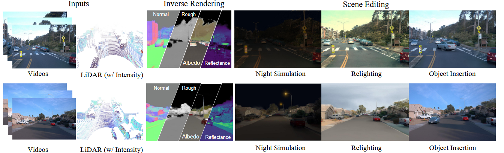

# InvRGB+L: Inverse Rendering of Complex Scenes with Unified Color and LiDAR Reflectance Modeling

ICCV 2025.

A 3DGS-based inverse rendering framework for both RGB and LiDAR simulation!
</p>

<p align="center">
    <!-- project -->
    <a href="https://github.com/cxx226/InvRGBL"></a>
    <!-- paper -->
    <a href="https://arxiv.org/pdf/2507.17613">
        
    </a>
</p>

<p align="center">
  
</p>

## About

We present InvRGB+L, a novel inverse rendering model that reconstructs large, relightable, and dynamic scenes from a single RGB+LiDAR sequence. 
Conventional inverse graphics methods rely primarily on RGB observations and use LiDAR mainly for geometric information, often resulting in suboptimal material estimates due to visible light interference. 
We find that LiDAR’s intensity values—captured with active illumination in a different spectral range—offer complementary cues for robust material estimation under variable lighting. 
Inspired by this, InvRGB+L~leverages LiDAR intensity cues to overcome challenges inherent in RGB-centric inverse graphics through two key innovations: (1) a novel physics-based LiDAR shading model and (2) RGB–LiDAR material consistency losses. 
The model produces novel-view RGB and LiDAR renderings of urban and indoor scenes and supports relighting, night simulations, and dynamic object insertions—achieving results that surpass current state-of-the-art methods in both scene-level urban inverse rendering and LiDAR simulation.

## 🔄 Update

- [ ] Training code release
- [ ] Data preparation instructions


## 🔨 Installation

Run the following commands to set up the environment:

```shell
# Clone the repository
git clone https://github.com/cxx226/InvRGBL
cd InvRGBL

# Create the environment
conda create -n InvRGBL python=3.9 -y
conda activate InvRGBL
pip install -r requirements.txt
pip install git+https://github.com/nerfstudio-project/gsplat.git@v1.3.0
pip install git+https://github.com/facebookresearch/pytorch3d.git
pip install git+https://github.com/NVlabs/nvdiffrast
pip install ./bvh
```

## 📊 Prepare Data
We conduct our experiments on the Waymo dataset, and the data preparation process is detailed in the following document:

- Waymo: [Data Process Instruction](docs/Waymo.md)


## 🚀 Running
### Training
```shell
export PYTHONPATH=$(pwd)
start_timestep=0 # start frame index for training
end_timestep=50 # end frame index, -1 for the last frame

python tools/train.py \
    --config_file configs/invrgbl.yaml \
    --output_root $output_root \
    --project $project \
    --run_name $expname \
    dataset=waymo/1cams \ #camera number
    data.scene_idx=$scene_idx \
    data.start_timestep=$start_timestep \
    data.end_timestep=$end_timestep
```


## 🙏 Acknowledgments

This repository is built upon [DriveStudio](https://github.com/ziyc/drivestudio).  
We gratefully thank the authors for sharing their excellent codebase.  

## Citation
```
@article{chen2025invrgb+,
  title={InvRGB+L: Inverse Rendering of Complex Scenes with Unified Color and LiDAR Reflectance Modeling},
  author={Chen, Xiaoxue and Chandaka, Bhargav and Lin, Chih-Hao and Zhang, Ya-Qin and Forsyth, David and Zhao, Hao and Wang, Shenlong},
  journal={arXiv preprint arXiv:2507.17613},
  year={2025}
}
```
